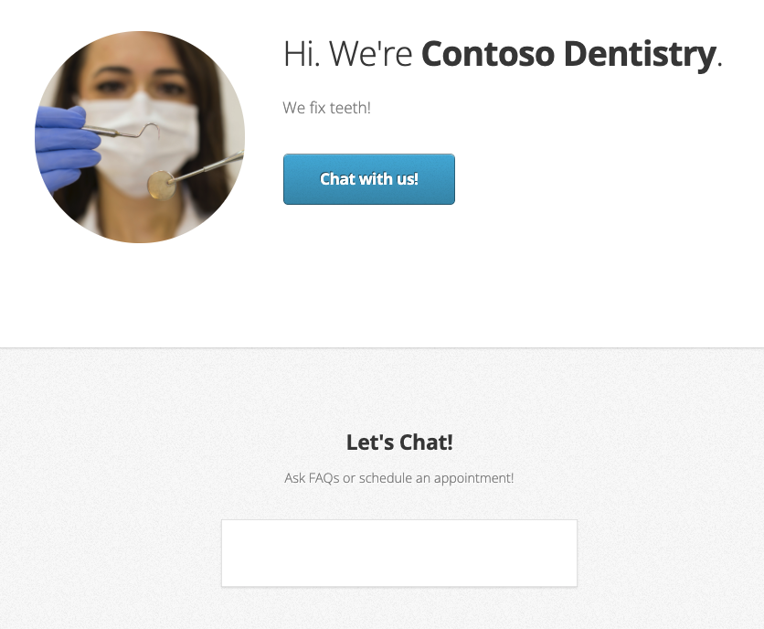

# Dental Office ChatBot, Udacity Project

Build a customer support chatbot that lives on a dentist website. The bot will use Azure QnA Maker and LUIS to answer patient questions and help them schedule appointments.
This parent repository is linked to 3 different child repositories where the solution has been built

- Dental Office Chatbot: This solution consists of a Node.js backend that handles the logic of the chatbot. It is connected to the language/bot resource in Azure, enabling the chatbot to communicate with users and provide assistance related to dental office inquiries.
- Dental office schedule api: This API serves as a third-party integration for scheduling appointments and retrieving available time slots. It allows patients to view and book appointments based on their preferred timing and availability.
- Dental office website: The official website of the dental office serves as the primary interface for customers. Users can interact with the chatbot on the website, asking questions and receiving responses. Additionally, they can schedule appointments with dentists based on their own schedules, leveraging the capabilities of the chatbot and the Dental Office Schedule API.

## Architecture

The architecture of the solution is shown below.

## Website

The website we are building is shown below.

